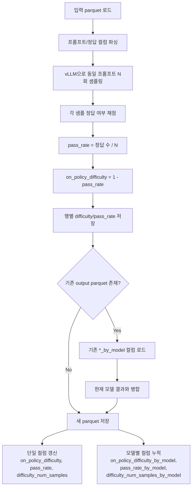

# on-policy difficulty 어노테이션 (간단 버전)

`annotate_difficulty_vllm.py`는 parquet 데이터를 읽어서,
vLLM(OpenAI-compatible endpoint)로 여러 번 샘플링한 pass-rate 기반 난이도를 저장합니다.

## on-policy difficulty 측정 흐름 (시각화)



### 해석 포인트
- 난이도는 **정답률(pass_rate)의 보수**로 정의됩니다: `on_policy_difficulty = 1 - pass_rate`.
- `--num_samples_per_prompt`가 클수록 pass-rate 추정이 안정적이지만, 비용/시간이 증가합니다.
- 동일 데이터에 대해 모델을 바꿔 반복 실행하면 `*_by_model` 컬럼에 모델별 결과가 누적됩니다.

## 실행 예시

```bash
python customized/data_annotate/annotate_difficulty_vllm.py \
  --input_parquet /data/train.parquet \
  --output_parquet /data/train_annotated.parquet \
  --vllm_base_url http://127.0.0.1:8000/v1 \
  --model Qwen/Qwen2.5-7B-Instruct
```

## 필수/핵심 옵션

- `--input_parquet` (여러 개 가능)
- `--output_parquet`
- `--vllm_base_url`
- `--model`
- `--temperature`, `--top_p`, `--max_tokens`
- `--num_samples_per_prompt`
- `--concurrency`, `--batch_size`
- `--overwrite`
- `--dry_run_n`

## 출력 컬럼

- `on_policy_difficulty` = `1 - pass_rate`
- `pass_rate`
- `difficulty_num_samples`
- `on_policy_difficulty_model`
- `on_policy_difficulty_by_model` (모델별 난이도 dict)
- `pass_rate_by_model` (모델별 pass_rate dict)
- `difficulty_num_samples_by_model` (모델별 샘플 수 dict)

기존 단일 컬럼(`on_policy_difficulty`, `pass_rate`, `difficulty_num_samples`)은
**마지막으로 어노테이션한 모델 기준 값**으로 유지됩니다.
여러 모델로 반복 실행하면 `*_by_model` 컬럼에 모델별 값이 누적됩니다.

또한 `--output_parquet` 파일이 이미 존재하면, 기존 파일의 모델별 컬럼을 먼저 읽어와서
현재 실행 결과에 병합한 뒤 저장합니다(행 개수가 동일한 경우).  
즉, 같은 입력 데이터에 대해 모델만 바꿔 여러 번 실행해도 기존 모델 결과가 덮어써지지 않습니다.

호환성: 기존 파일/입력 데이터에 `*_by_model` 컬럼이 없어도 실행 시 자동으로 빈 dict로 초기화됩니다.  
기존 parquet 재사용 경로에서도 비어 있거나 NaN인 모델별 컬럼은 dict 형태로 정규화해 안전하게 병합됩니다.
